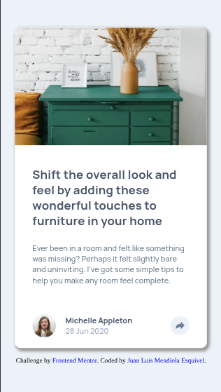
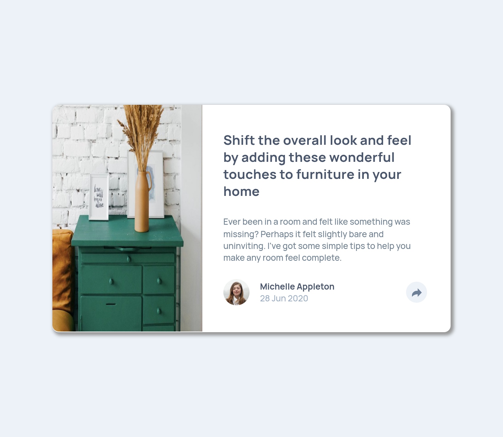
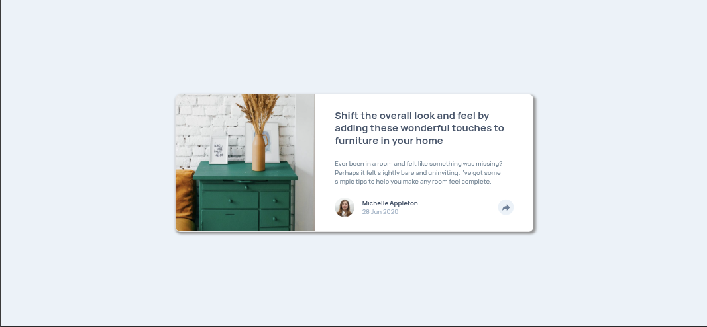

# Frontend Mentor - Article preview component solution

This is a solution to the [Article preview component challenge on Frontend Mentor](https://www.frontendmentor.io/challenges/article-preview-component-dYBN_pYFT). Frontend Mentor challenges help you improve your coding skills by building realistic projects. 

## Overview

### The challenge

Users should be able to:

- View the optimal layout for the component depending on their device's screen size
- See the social media share links when they click the share icon

### Screenshots

### Links

- Solution URL: [https://www.frontendmentor.io/solutions/article-preview-component-using-flexbox-gljqBvvuV3](https://www.frontendmentor.io/solutions/article-preview-component-using-flexbox-gljqBvvuV3)
- Live Site URL: [https://mendibox.github.io/article-preview-component/](https://mendibox.github.io/article-preview-component/)

## My process

### Built with

- Mobile-first workflow
- Semantic HTML5 markup
- Flexbox

## Author

- Frontend Mentor - [@mendibox](https://www.frontendmentor.io/profile/mendibox)
- X - [@mendibox](https://x.com/mendibox)
